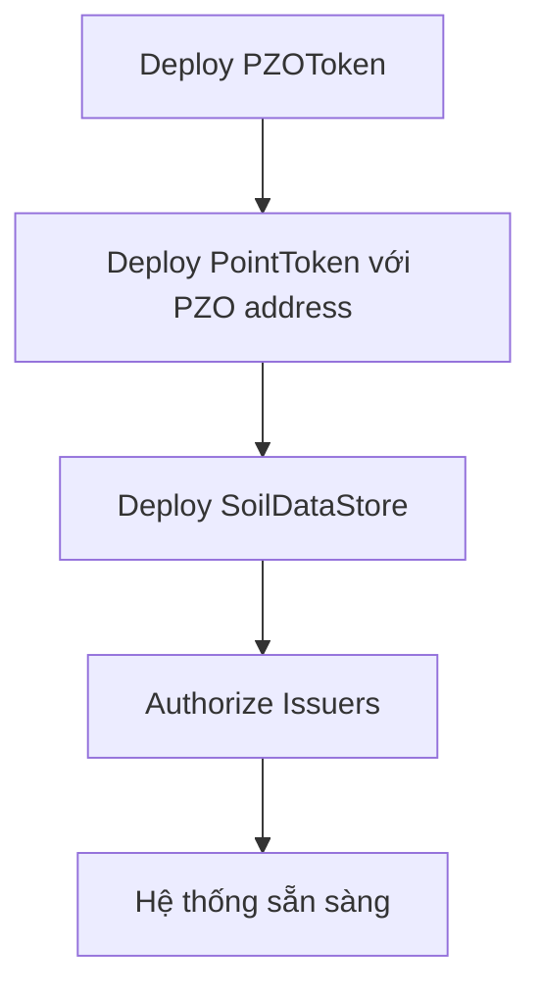
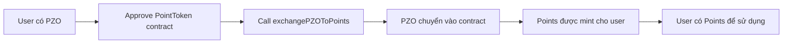
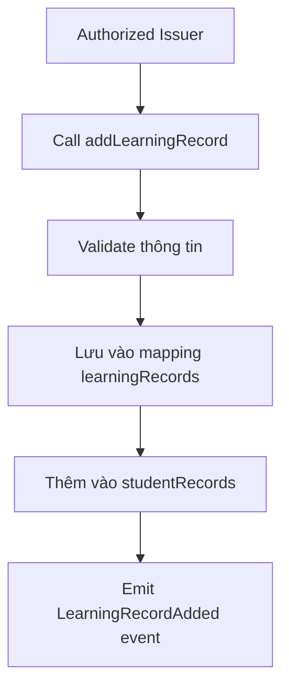
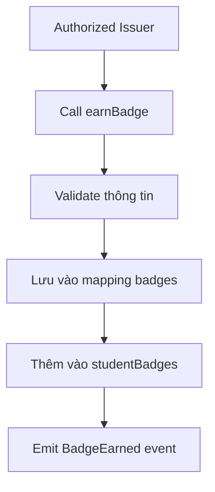
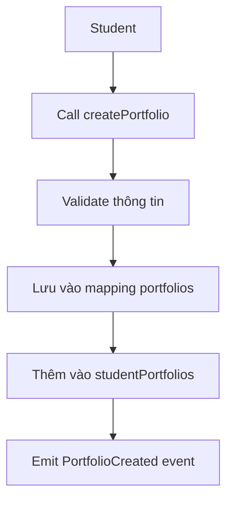

# 📊 Phân tích Flow hoạt động của Smart Contract EduWallet

## 🏗️ **Kiến trúc tổng quan**

Dự án EduWallet có **3 Smart Contract chính**:

### 1. **PZOToken.sol** - Token gốc
- **Mục đích**: Token chính của hệ thống
- **Tính năng**: 
  - ERC20 token với tên "Pione Zero Token" (PZO)
  - Mint 1,000,000 PZO tokens cho deployer
  - Chỉ owner có thể mint thêm tokens
  - User có thể burn tokens

### 2. **PointToken.sol** - Token điểm thưởng
- **Mục đích**: Token điểm thưởng cho học tập
- **Tính năng**:
  - ERC20 token với tên "EduWallet Points" (POINT)
  - **Tỷ lệ quy đổi**: 1 PZO = 1000 Points (0.1 PZO = 100 Points)
  - Chuyển đổi PZO → Points
  - Rút Points → PZO (chỉ admin)

### 3. **SoilDataStore.sol** - Lưu trữ dữ liệu học tập
- **Mục đích**: Lưu trữ hồ sơ học tập, badge, portfolio
- **Tính năng**:
  - Learning Records (học bạ)
  - Badges (huy hiệu)
  - Portfolios (danh mục dự án)

## 🔄 **Flow hoạt động chi tiết**

### **Phase 1: Khởi tạo hệ thống**



### **Phase 2: Flow Token Exchange**



**Chi tiết quy đổi:**
- **Input**: 0.1 PZO (100000000000000000 wei)
- **Output**: 100 Points (100000000000000000000 wei)
- **Công thức**: `pointAmount = (pzoAmount * 100) / (10^18)`

### **Phase 3: Flow quản lý dữ liệu học tập**

#### **3.1. Thêm Learning Record (Học bạ)**


**Dữ liệu lưu trữ:**
- Student name, institution, course name
- Certificate hash (IPFS)
- Completion date, score
- Issuer address, student address

#### **3.2. Tạo Badge**


#### **3.3. Tạo Portfolio**


## 🔐 **Hệ thống phân quyền**

### **Owner (Deployer)**
- ✅ Mint PZO tokens
- ✅ Authorize/revoke issuers
- ✅ Withdraw Points to PZO
- ✅ Quản lý toàn bộ hệ thống

### **Authorized Issuers**
- ✅ Thêm Learning Records
- ✅ Tạo Badges cho students
- ❌ Không thể mint tokens
- ❌ Không thể quản lý issuers khác

### **Students**
- ✅ Tạo Portfolio
- ✅ Exchange PZO to Points
- ✅ Xem dữ liệu của mình
- ❌ Không thể tạo Learning Records
- ❌ Không thể tạo Badges

## 📊 **Cấu trúc dữ liệu**

### **LearningRecord Struct**
```solidity
struct LearningRecord {
    uint256 id;
    string studentName;
    string institution;
    string courseName;
    string certificateHash;  // IPFS hash
    uint256 completionDate;
    uint256 score;
    bool verified;
    address issuer;
    address student;
}
```

### **Badge Struct**
```solidity
struct Badge {
    uint256 id;
    string name;
    string description;
    string imageHash;  // IPFS hash
    uint256 earnedDate;
    address student;
    bool active;
}
```

### **Portfolio Struct**
```solidity
struct Portfolio {
    uint256 id;
    string title;
    string description;
    string projectHash;  // IPFS hash
    string[] skills;
    uint256 createdDate;
    address owner;
}
```

## 🔗 **Tích hợp với Frontend/Backend**

### **Frontend Integration**
- **MetaMask**: Kết nối ví, ký transactions
- **Web3 Provider**: Tương tác với contract
- **IPFS**: Lưu trữ file metadata
- **React Context**: Quản lý state

### **Backend Integration**
- **Blockchain Service**: Tương tác với contract
- **MongoDB**: Cache dữ liệu off-chain
- **API Endpoints**: Cung cấp dữ liệu cho frontend
- **Event Listening**: Theo dõi contract events

## 🚀 **Deployment Flow**

### **1. Chuẩn bị**
```bash
# Cài đặt dependencies
npm install

# Cấu hình environment
RPC_URL=https://rpc.zeroscan.org
PRIVATE_KEY=0x...
```

### **2. Compile & Deploy**
```bash
# Compile contracts
npx hardhat compile

# Deploy tokens
npx hardhat run scripts/deploy-tokens.js --network pzo

# Deploy data store
npx hardhat run scripts/deploy.js --network pzo
```

### **3. Cập nhật Environment**
```bash
# Backend
EDUWALLET_DATASTORE_ADDRESS=0x...

# Frontend
REACT_APP_PORTFOLIO_CONTRACT_ADDRESS=0x...
```

## 🎯 **Use Cases chính**

### **1. Student Journey**
1. **Đăng ký**: Tạo ví MetaMask
2. **Nhận PZO**: Từ airdrop hoặc mua
3. **Exchange**: Chuyển PZO thành Points
4. **Học tập**: Hoàn thành khóa học
5. **Nhận Badge**: Issuer tạo badge
6. **Tạo Portfolio**: Upload dự án
7. **Chia sẻ**: Hiển thị thành tích

### **2. Issuer Journey**
1. **Đăng ký**: Yêu cầu authorization
2. **Được phê duyệt**: Owner authorize
3. **Tạo khóa học**: Upload lên IPFS
4. **Cấp chứng chỉ**: Tạo Learning Record
5. **Trao badge**: Tạo Badge cho student

### **3. Admin Journey**
1. **Deploy contracts**: Khởi tạo hệ thống
2. **Quản lý issuers**: Authorize/revoke
3. **Quản lý tokens**: Mint PZO khi cần
4. **Monitor**: Theo dõi hoạt động hệ thống

## ⚠️ **Các vấn đề cần lưu ý**

### **1. Gas Optimization**
- Sử dụng events thay vì storage cho dữ liệu không cần thiết
- Batch operations khi có thể
- Optimize struct layout

### **2. Security**
- Input validation cho tất cả parameters
- Access control chặt chẽ
- Reentrancy protection

### **3. Scalability**
- IPFS cho file storage
- Off-chain indexing cho queries
- Layer 2 solutions cho tương lai

## 🎉 **Kết luận**

Hệ thống Smart Contract EduWallet được thiết kế với:
- ✅ **Kiến trúc modular**: 3 contracts riêng biệt
- ✅ **Phân quyền rõ ràng**: Owner, Issuer, Student
- ✅ **Token economy**: PZO ↔ Points exchange
- ✅ **Dữ liệu bất biến**: Blockchain storage
- ✅ **Tích hợp IPFS**: File storage
- ✅ **Event-driven**: Real-time updates

**Hệ thống đã sẵn sàng để deploy và sử dụng!** 🚀
